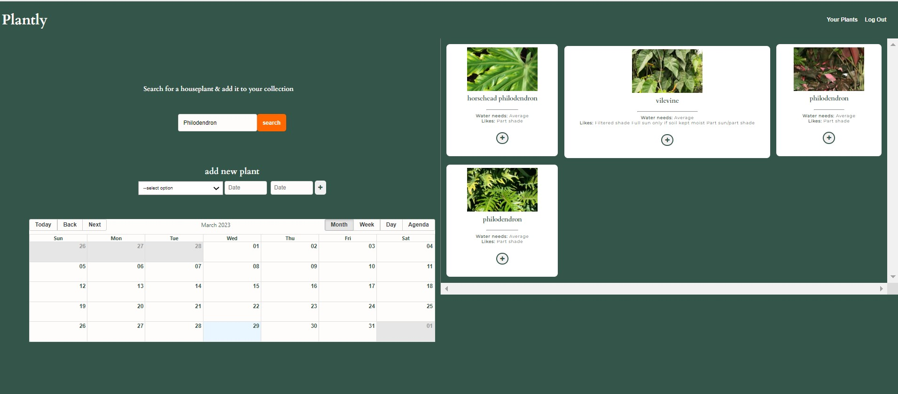
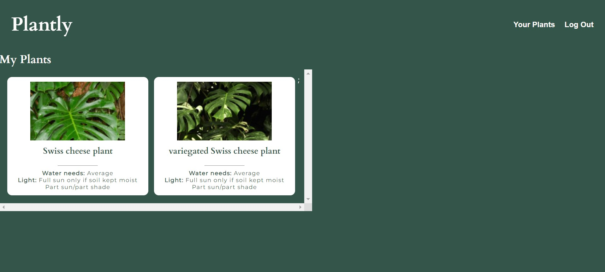

# PLANTLY: Watering Scheduling Application

---------------------------------------------------------

___________________________________________________________________

TABLE OF CONTENTS
--------------------------------------------------------------
# contents 
# [description](#description)
# [installation](#installation)
# [usage](#usage)
# [license](#license)
# [contributions](#contributions)
# [tests](#tests)
# [questions](#questions)

______________________________________________________________
DESCRIPTION (#description)
--------------------------------------------------------------
The PLANTLY application, allows for users to search a houseplant API to find the houseplants they own, it allwos them to add them to their household and schudule on a calender when each plant requires watering. Allowing them to take the best care of their houseplants, and avoid over or underwatering their plants. '
______________________________________________________________
______________________________________________________________

Screen shot of landing sign up page:

_____________________________________________________________
______________________________________________________________

Screen shot of main home page, with browse and calender functionality:

_____________________________________________________________
______________________________________________________________

Screen shot of your household page where users saved plants are shown:

_____________________________________________________________
INSTALLATION (#installation)
--------------------------------------------------------------
none
______________________________________________________________
______________________________________________________________
USAGE (#usage)
--------------------------------------------------------------
Users engage with the application through their web browser, they must create an account to use the application, they then simply have to search for their houseplants, add them to their household and updated their personal account calender.
______________________________________________________________
______________________________________________________________
LICENSE (#license)
--------------------------------------------------------------
MIT
______________________________________________________________
______________________________________________________________
CONTRIBUTIONS (#contributions)
--------------------------------------------------------------
This application was made by: 
Lisa Anufrieva
Fiona Dunnington
Peter Bokor
Laurence Moreton Burt

We used, React, ReacQuery, Font Awesome,React Big Calender, Moment, Axios and Perenular API to create th e final products. 

Some resources used are: 
https://www.freecodecamp.org/news/how-to-persist-a-logged-in-user-in-react/  

https://stackoverflow.com/questions/62861269/attempted-import-error-usehistory-is-not-exported-from-react-router-dom 

https://stackoverflow.com/questions/2218999/how-to-remove-all-duplicates-from-an-array-of-objects 
______________________________________________________________
______________________________________________________________
TESTS (#tests)
--------------------------------------------------------------
N/A

______________________________________________________________
______________________________________________________________

QUESTIONS (#questions)
--------------------------------------------------------------
If you have further qestions regardin PLANTLY you can reach find us on github at:
# https://github.com/eliza-an
# https://github.com/fdunnington
# https://github.com/Moorgal
# https://github.com/laurencemb

______________________________________________________________
